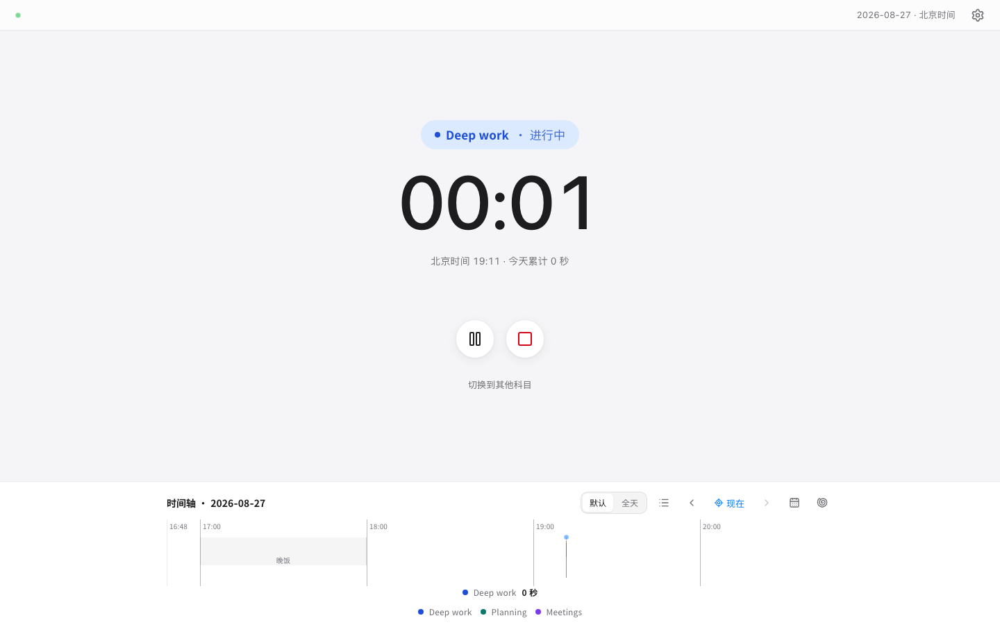

# Open Timer

[English](README.md)

**一个默认私密、自托管的工作计时器：服务端计时事实、可自行管理的项目，以及日时间轴。**



Open Timer 适合深度工作、学习、会议、客户项目或任何需要记录投入时间的场景。它默认不公开你的项目、备注和计时历史。

## 特性

- 服务端为计时事实来源，暂停、继续、刷新、休眠和多标签页不会重复或丢失时间。
- 在设置中自行新增、改名、分组、改颜色、排序和归档项目；归档后仍保留历史。
- 日时间轴和日报；数据用 UTC 保存、按 Asia/Shanghai 划分自然日。
- 可选 AI 助手：支持硅基流动和其他 HTTPS OpenAI 兼容接口；密钥只在服务端 AES-GCM 加密保存。
- Docker Compose + SQLite 快速部署，也支持 Cloudflare Workers + D1。

## Docker Compose 快速开始

需要 Docker Desktop 或带 Compose 插件的 Docker Engine。

```sh
git clone https://github.com/Evan-Joseph/open-timer.git
cd open-timer
# 可选：使用命名发布版本，而不是会持续变动的 main 分支。
# git checkout v0.1.0
cp .env.example .env
```

编辑 `.env`，填写唯一的六位 PIN 和一个长期稳定的加密主密钥：

```dotenv
CLOCK_INITIAL_OWNER_PIN=123456
# 可用 openssl rand -base64 32 生成
AI_CONFIG_ENCRYPTION_KEY=paste-a-long-random-value-here
```

启动：

```sh
docker compose up -d --build
curl http://127.0.0.1:4517/api/v1/health
```

打开 <http://localhost:4517>，使用 `CLOCK_INITIAL_OWNER_PIN` 登录。

Compose 默认只绑定本机 `127.0.0.1`。需要公网访问时，请放在 HTTPS 反向代理之后，并设置 `CLOCK_COOKIE_SECURE=true`。完整的备份、升级和恢复说明见 [Docker 指南](docs/docker.md)。

每个版本 tag 都会发布对应容器镜像到
[`ghcr.io/evan-joseph/open-timer`](https://github.com/Evan-Joseph/open-timer/pkgs/container/open-timer)。

## 文档

- [Docker 部署、备份、升级与恢复](docs/docker.md)
- [Cloudflare Workers + D1 部署](docs/cloudflare.md)
- [完整配置项](docs/configuration.md)
- [隐私与安全模型](docs/security-model.md)
- [架构说明](docs/architecture.md)
- [更新日志](CHANGELOG.md)

## 开发

需要 Node.js 22 或更新版本。

```sh
npm ci
npm test
npm run typecheck
npm run build
npm run test:e2e
```

贡献方式见 [CONTRIBUTING.md](CONTRIBUTING.md)。安全问题请按 [SECURITY.md](SECURITY.md) 中的私密报告方式提交，切勿在公开 Issue 中粘贴 API Key、Cookie、导出数据或个人计时记录。

## 许可

Open Timer 使用 [MIT License](LICENSE)。字体等第三方声明见 [THIRD_PARTY_NOTICES.md](THIRD_PARTY_NOTICES.md)。
