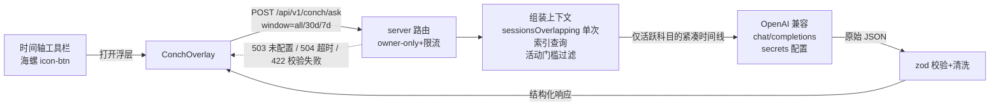

# 神奇海螺 · 「下一步做什么」推荐 —— 功能设计（2026-08-23）

> 状态：**已实现并上线（2026-08-23 部署，Version 43a772c7）**。
> 命名取自《海绵宝宝》神奇海螺（"神奇海螺，我们该做什么？"），代码标识统一为 `conch`。

## 1. 定位与边界

- 功能：根据各科目**计时执行记录 + 手动备注**的时间线，由 LLM 推断用户的学习节奏，对每个**近期活跃**科目给出"下一步最应该做什么"的具体建议。
- 边界（与 README 一致）：本项目只记录时间执行数据。神奇海螺**只做节奏推断与行动建议**，不判断正确率、掌握度、覆盖率；建议仅供参考，不写回任何学习事件，不与 study-ledger 交互。
- 名字与文案基调：轻、俏皮但克制（"神奇海螺说……"仅出现在浮层标题副文案，不刷屏）。

## 2. 行为定义

1. **推荐对象**：仅对"近期活跃"科目生成推荐（活动门槛见 §5.2，服务端硬性判定，不依赖模型自觉）。
2. **不推荐的科目**分两类，均在浮层底部以弱态列出：
   - `not_started`：全时段 0 条有效会话（科目还没开）；
   - `inactive`：历史有记录但最近 7 个北京日无有效会话。
3. **窗口**：`all`（从始至今，默认）/ `30d` / `7d`，浮层内分段控件切换，切换即重新请求。窗口只影响送进 LLM 的时间线；活动门槛固定为最近 7 天。
4. **进行中会话**：卡片可按前端实时状态显示"进行中"徽标，但**不进入 LLM 决策输入，也不使缓存失效**；海螺只根据已完成专注时间线给出下一步。
5. **一键开始**：每张推荐卡带「开始这个科目」按钮 → 选中该科目并预填 `intent_note`（= `next_action` 截断 200 字）→ 关闭浮层，进入常规开始流程（用户可改可删）。

## 3. 架构与流程



- **LLM 调用在服务端**：密钥只存在于 Worker secrets / 本地 env，永不下发客户端；客户端零密钥。
- 兼容任意 **OpenAI 兼容** `/chat/completions` 端点；`CONCH_API_BASE` 指向其文档规定的 base URL（当前 DeepSeek 官方端点不带 `/v1`）。
- 失败路径全部结构化，前端按 §8.5 呈现，永不静默。

## 4. 服务端设计

### 4.1 配置（`server/src/config.ts` 扩展）

| 环境变量 | Workers secret | 说明 |
|---|---|---|
| `CONCH_API_BASE` | ✅ | OpenAI 兼容 base；未配置 → 功能整体关闭 |
| `CONCH_API_KEY` | ✅（wrangler secret put） | 仅服务端持有 |
| `CONCH_MODEL` | ✅ | 模型名；默认空（必填） |
| `CONCH_THINKING_BUDGET` | 可选 | 仅非 DeepSeek 官方兼容端点使用的思考 token 预算；不设 = 模型默认思考 |

**当前选型（2026-08-31）**：DeepSeek 开放平台，`CONCH_API_BASE=https://api.deepseek.com`，`CONCH_MODEL=deepseek-v4-pro`。官方文档确认该模型实际指向 V4-Pro-0813，支持 JSON Output 和思考模式；服务端使用 `thinking: { type: 'enabled' }`、`reasoning_effort: 'high'`、`response_format: { type: 'json_object' }` 与 `max_tokens: 4096`。官方说明思考模式下 `temperature` 不生效，故不发送该字段。
此前 SiliconFlow 的 Ling Flash 虽能快速返回 JSON，但在完整历史中把“第 6 章题目已完成、收尾题已订正并理解完、当前已进入第 7 章”误读为第 6 章未收尾，已退役。DeepSeek JSON Output 可能偶发空或仅空白 `content`；服务端将其直接归类为 `422 LLM_OUTPUT_INVALID`，不伪装成网络错误，也不在响应不确定时隐式重发 POST。

本地 Node 开发读同名 `process.env`；生产 `wrangler.jsonc` 不写密钥（secrets 管理）。未配置时 `POST /api/v1/conch/ask` 返回 `503 { error: 'CONCH_NOT_CONFIGURED' }`，前端入口仍显示、浮层给配置提示（不报错氛围）。

### 4.2 端点契约

```
GET  /api/v1/conch/revision   （owner cookie；仅返回一行 semantic revision，用于缓存校验）
POST /api/v1/conch/ask        （owner cookie + Origin 校验 + 跨 Worker 的实际模型调用额度 20 次/小时）
请求体:  { "window": "all" | "30d" | "7d", "force"?: true }
可选头:  X-Client-Request-Id: conch-…（短随机诊断号；仅合法值回显）
成功 200: 见 §6 响应体
错误:     400 INVALID_WINDOW | 401（未登录）| 402 CONCH_QUOTA_EXHAUSTED | 409 CONCH_GENERATING / CONCH_CONTEXT_STALE | 422 LLM_OUTPUT_INVALID
          429 RATE_LIMITED | 503 CONCH_NOT_CONFIGURED / CONCH_CREDENTIAL_INVALID | 504 LLM_TIMEOUT（45s AbortController）
          502 LLM_UPSTREAM（上游非 200/网络错误，不透传上游细节）| 500 INTERNAL
```

实现要点：
- **完整上下文只由租约持有者读取**：先读 `conch_revision` 与 D1 共享缓存；命中或租约竞争失败时不读时间线。仅持有租约的 miss 才执行 `storage.sessionsOverlapping(0, nowMs+1)`（`session_ended` 索引 range + 活动部分索引）与 `segmentsForSessions`。
- 误触过滤复用 `isCountedSegment(seg, config.minSegmentMs)`；日切一律 `shanghaiDayRangeUtc`。
- DeepSeek 官方请求固定 `thinking: { type: 'enabled' }`、`reasoning_effort: 'high'`、`max_tokens: 4096` 与 `response_format: { type: 'json_object' }`；不发送思考模式下不生效的 `temperature`，也不发送 SiliconFlow 专用 `thinking_budget`。每次用户请求最多发出一次上游 POST，45 秒总预算；JSON Output 为空直接返回 422，网络中断或超时不做隐式重发，由用户显式「再问一次」。
- **日志纪律**：请求/响应体（含备注全文与 LLM 输出）一律不进日志，沿用"日志不含备注全文"约束。
- **故障关联**：仅记录 `{ event, stage, request_id, elapsed_ms, model, window, conch_revision, error_class, attempt, upstream_status?, internal_stage? }`；`stage` 为 `entered`/`upstream_ok`/`upstream_error`/`internal_error`。Safari 出现网络错误时，用户可提供界面显示的短诊断号以和 Worker tail 对照，不能借此记录或展示问题正文。
- 成功建议、生成租约和小时额度写 D1。缓存 key 是 `conch_revision + model + window`；租约是条件写入，覆盖 45 秒上游总预算与 15 秒 D1 收尾。多个标签页或 Worker 同时 miss 时只有一个请求会调用模型，其余得到 `409 CONCH_GENERATING` + `retry_after_ms` 并由客户端等待重试。额度只在真正调用上游前消耗，缓存命中不占额度。

### 4.3 响应缓存

服务端 D1 是跨设备/跨 Worker 的成功结果缓存，客户端 localStorage（键 `clock-conch-cache-v5`）只是本设备的零 RTT 展示缓存。两层均以专用 `conch_revision`、当前 `model` 与响应的 `cache_valid_until` 校验；只有已完成时间线与模型均未变，且输入窗口尚未滚动越界时才复用：

- 使缓存失效：完成一段专注、修改完成备注、修正时长/起点、撤回、把已完成会话重开；
- **不**使缓存失效：开始、暂停、继续、当前进行中秒数变化、主题/设置/浮层开合；
- 打开已有本地缓存时只 `GET /api/v1/conch/revision`（一行 DB 读取，不拉时间轴、不调用模型）；revision、model 和 `cache_valid_until` 均有效才复用，**零 LLM token**。`cache_valid_until` 取当前输入最早变化边界，最晚不跨下一个北京时间自然日；近 7/30 天会在历史段开始被连续窗口裁剪或会话行离窗时提前失效。异常长段正跨窗口时本次照常生成，但不写共享缓存。本地未命中时服务端读取 D1 共享结果；state 暂不可用时才以 30 分钟 TTL 兜底；「重新问一次」显式绕过并覆盖共享结果。登出或 owner 会话失效会清除本机缓存。

`conch_revision` 与通用审计 `revision` 分离，后者仍服务 ETag/诊断。D1 缓存只保存服务端清洗过的结构化建议，外部 HTTP 响应仍为 `no-store`，不进入 CDN 共享缓存。

## 5. 结构化输入（server → LLM）

### 5.1 编码原则

- 每个科目一个块；**只纳入已 stopped 且通过误触过滤的会话**；每条会话一行紧凑编码；备注取 `end_note ?? intent_note`（与 `/sessions` API 的 `note` 口径一致）。进行中/暂停会话只用于卡片实时徽标，不送模型。
- 时间一律北京时间，格式 `MM-DD HH:mm`；跨午夜会话不拆分（与日汇总口径一致，行内标注起止即可）。
- 行数预算：单科目 > 150 行时，保留**最近 45 天全量**，更早部分按月聚合为一行（`07 月 · 12 次 · 18.5h · 备注关键词: 强化题/第3章…`——关键词仅取备注中出现过的词）。全量场景（当前约 250 会话）约 20–30K token，大上下文模型直接吃。

### 5.2 活动门槛（服务端判定，先于 LLM）

对 7 个固定科目逐一分类：
- 全时段已完成有效会话数 = 0 → `not_started`（不进 LLM）；
- 最近 7 个北京日（含今日）已完成有效会话数 = 0 → `inactive`（不进 LLM）；
- 其余 → `active`，进 LLM。

**不活跃科目的时间线完全不进提示词**——从源头杜绝模型对未开科目编推荐（需求 2 的硬保证）。

### 5.3 user prompt 模板（实际下发格式）

```
统计窗口：从始至今（2026-08-05 起）
以下是 3 个近期活跃科目的时间线（旧→新），请按要求返回 JSON。

=== 数学二 (math) ===
累计 42 次 · 36.5h ｜ 近7天 8 次 · 9.2h ｜ 最近活动 08-23 15:30
08-16 08:02–09:40 1h38m "第4章 不定积分 基础题"
08-17 14:00–15:30 1h30m "第4章 不定积分 强化题"
...
08-23 08:02–09:30 1h28m "第5章 定积分 强化题"

=== 数据结构 (data-structures) ===
累计 30 次 · 25.0h ｜ 近7天 6 次 · 5.5h ｜ 最近活动 08-22 21:10
...

（政治、英语未列入：无近期活动）
```

无备注的行写作 `08-20 10:00–11:00 1h00m`（不附引号段）；`end_reason` 不下发（对推断无意义）。

### 5.4 system prompt（定稿文本）

```
你是「神奇海螺」，一名 11408 考研备考的节奏分析师。输入是用户（单用户本人）各科目
的真实计时记录：起止时间、有效时长、手动备注。你的唯一任务：为每个给出的科目推断
「下一步最应该做什么」。

【推断原则】
1. 先识别每个科目各自的节奏。常见如：看课→做对应章节题；基础题→强化题→冲刺题；
   看书→刷题；看课→看书→做题。不同科目节奏可能不同，逐个科目独立归纳，不要套用。
2. 以该科目最后一条记录为锚点外推下一步：上一步是看 E 章课，下一步大概率是做 E 章题；
   上一步是 B 章强化题且其节奏是基础→强化→冲刺，则下一步可能是 B 章冲刺题。
3. 检查缺步：对照近期「章节 × 步骤」的覆盖，若某章只看了课没做题、或只做了基础题
   缺强化，则优先建议补上这一步，并在 rationale 说明缺什么。
4. 只依据备注中出现过的事实推断。不得编造备注里从未出现的教材名、题集名、题号、
   课程名；引用资料时用用户自己的叫法（如"你一直在做的那本题集"）。
5. next_action 必须具体可立即执行，≤40 个汉字。好例子："做第5章 定积分的冲刺题"；
   坏例子："继续学数学"。
6. 若某科目历史太稀疏或规律不明，confidence 给 "low"，给出最稳妥的一般性下一步
   （如"继续上次未完成的进度"），并在 rationale 说明缺什么信息。

【硬约束】
- 只输出输入中给出的科目；不得新增、不得遗漏。
- 只返回符合 schema 的原始 JSON：不要 markdown 代码块、不要解释文字。

【返回 schema】
{
  "subjects": [
    {
      "subject_id": "string，与输入一致的科目 id",
      "next_action": "string，≤40 汉字，具体的下一步",
      "action_kind": "lecture|problems|book|review|test|other",
      "topic": "string|null，章节/主题，如「第5章 定积分」",
      "pattern": "string|null，观察到的节奏一句话，如「看课→基础题→强化题」",
      "rationale": "string，≤60 汉字，为什么推荐这一步",
      "confidence": "high|medium|low",
      "alternatives": ["string，1–3 条与主推荐不同方向的备选下一步，没有则空数组"]
    }
  ]
}
```

## 6. 结构化输出（server → 前端）

LLM 原始输出经 zod 校验清洗后，由服务端包装为最终响应（`shared/src/conch.ts` 定义类型，前后端共用）：

```json
{
  "window": "all",
  "generated_at": "2026-08-23T09:41:02Z",
  "cache_valid_until": "2026-08-24T00:00:00+08:00",
  "conch_revision": 42,
  "revision": 1832,
  "model": "deepseek-v4-pro",
  "subjects": [
    {
      "subject_id": "math",
      "display_name": "数学二",
      "status": "active",
      "running_now": true,
      "last_active_date": "2026-08-23",
      "next_action": "第6章微分方程看完课后，做对应基础题",
      "action_kind": "problems",
      "topic": "第6章 微分方程",
      "pattern": "看课 → 基础题 → 强化题",
      "rationale": "最近三次均为「看课→做题」循环，当前在看课，缺对应练习",
      "confidence": "high",
      "alternatives": ["回头补第5章强化题的错题", "预习下一章"]
    }
  ],
  "skipped": [
    { "subject_id": "politics", "display_name": "思想政治理论", "reason": "not_started" },
    { "subject_id": "english", "display_name": "英语二", "reason": "inactive" }
  ]
}
```

校验规则（任一不过 → 422，不半残下发）：`subjects[].subject_id` 必须在本次活跃集合内且不重复；`action_kind`/`confidence` 枚举收敛（非法值 → `other`/`low` 而非报错，字段级宽容、结构级严格）；`next_action` 超长截断至 80 字符；缺 `next_action` 的条目整体丢弃。

## 7. 字段 → 视觉映射

| 响应字段 | 呈现 | 样式依据（DESIGN.md） |
|---|---|---|
| `display_name` + 科目色 | 科目图标 + 名称 + 颜色 | `[data-color]` → `--sc`；名称始终保留，颜色不是唯一编码 |
| `running_now` | 「进行中」呼吸徽标 | `--success` + `--dur-breathe` |
| `next_action` | 卡片主文案 | `--fs-2xl`(22)/600，`--text-1` |
| `action_kind` | 小 chip：看课/刷题/读书/复习/模考/其他 | `--surface-2`，`--fs-xs`，胶囊 |
| `topic` | 并入主文案下方一行 | `--fs-sm`，`--text-2` |
| `rationale` | 次级说明 | `--fs-sm`，`--text-2` |
| `pattern` | 卡片底部节奏线（可选展示） | `--fs-xs`，`--text-3` |
| `confidence` | 右上角文案：高 / 中 / 低 | 高=`--success`，中=中性，低=`--amber`；不借用科目色 |
| `alternatives` | 「或者」备选行：可点击开工 + 「换一换」轮换（2026-08-25 升级） | 备选钮 32px 胶囊静默档，`--fs-sm`；换一换 `--fs-xs` |
| `skipped` | 底部弱态行："政治 · 还没开始" / "英语 · 最近没活动" | `--fs-xs`，`--text-3`，不设卡片 |

## 8. 前端设计（ConchOverlay）

### 8.1 入口

时间轴工具栏新增 `icon-btn`（lucide `Shell`，32px，aria-label/title「神奇海螺」），位于「近 7 天回顾」按钮旁，同属 32px 行（工具栏契约）。未配置（503）时入口仍显示——点开才知道为什么，避免"按钮凭空消失"的困惑。

### 8.2 浮层骨架

完全复用「近 7 天回顾」的居中浮层范式（DESIGN.md §6）：面板 `min(720px, 100vw-64px)`、`max-height: 100dvh-64px` 内滚、遮罩 `--overlay-scrim`、材质 `--popover-surface`、250ms 入场；关闭三通道 Esc / 遮罩 / 右上 X。`conchOpen` 为设备本地持久状态（2026-08-24 起不跨端同步，避免多端打开浮层重复请求 LLM）。

### 8.3 布局

```
┌─ 神奇海螺 · 下一步做什么 ──────────── [⟳ 重新问一次] [✕] ─┐
│  [从始至今 | 近30天 | 近7天]  （.seg-control，32px 行）      │
│                                                              │
│  ┌ 数学二 ▮(进行中) · 最近活动 今天 ────────── ● high ─┐   │
│  │  [刷题] 第6章微分方程看完课后，做对应基础题          │   │
│  │  最近三次均为「看课→做题」循环，当前在看课，缺对应练习│   │
│  │  节奏：看课 → 基础题 → 强化题     或者：补第5章错题   │   │
│  │                                    [ 开始这个科目 ]   │   │
│  └──────────────────────────────────────────────────────┘   │
│  ┌ 数据结构 ▮ · …… ┐  （按 sortOrder 依次）                 │
│                                                              │
│  政治 · 还没开始    英语 · 最近没活动                        │
└──────────────────────────────────────────────────────────────┘
```

按钮权重（DESIGN.md §3 规则）：每张卡片内「开始这个科目」是唯一的上下文 primary（`primary-btn contextual-action`，继承该科目的 action token）；备选开工与「重新问一次」保持低权重，后者是 `icon-btn`（请求中禁用并旋转）。

### 8.4 状态机

`idle → loading → ready | error`。
- loading：海螺图标呼吸（`--dur-breathe`）+ "神奇海螺正在看已完成的记录…"；`prefers-reduced-motion`/关动画时静态文案。
- ready 且 `subjects` 为空：空态文案"最近没有活跃科目，先去学一会儿吧"。
- 客户端缓存命中（同 `window+conch_revision+model` 且未到 `cache_valid_until`）直接渲染；本机未命中时由 D1 共享缓存兜底。若另一处正在生成，或生成期间时间线/窗口变化，浮层保持 loading 并按 `retry_after_ms` 自动重试，不能把协调态误报为网络错误。

### 8.5 错误态（一律可重试、不吓人）

| 错误 | 文案 |
|---|---|
| 503 未配置 | "海螺还没接上大脑：服务端未配置 CONCH_*（见 docs/神奇海螺-设计）" |
| 504 超时 / 502 上游 | "海螺沉思太久没回过神来，再问一次？" [重试] |
| 422 解析失败 | "海螺这次说话含糊，再问一次？" [重试] |
| 429 | "问得太勤啦，稍后再来" |

## 9. 安全 / 隐私 / 成本

- 密钥只在服务端（secrets/env）；响应不含上游任何元信息；错误体不泄漏上游细节与栈。
- 备注会随请求发给 `CONCH_API_BASE` 指向的模型服务——即用户自选的信任域，文档与首屏 503 文案中明示。
- D1：首次问答 = 一次索引 range 查询 + segments 查询，同 0003 口径，无全表扫描；语义匹配时服务端结果缓存只读 `conch_response_cache`，客户端本地命中只读 `conch_timeline_state` 一行。
- LLM 调用频率：语义缓存 + D1 原子额度 20 次/小时；`all` 窗口输入约 20–30K token（当前数据量）。

## 10. 实现拆分（下一轮）

1. `shared`：`conch.ts` 类型（请求/响应/枚举）+ 上下文组装纯函数（紧凑行编码、活动门槛、月度聚合）+ 单测。
2. `server`：config 扩展、`POST /api/v1/conch/ask` 路由（限流/超时/校验/日志纪律）、llm client（fetch + AbortController）+ 集成测试（本地 dev 以 stub base 注入假响应）。
3. `web`：`ConchOverlay.tsx` + 工具栏入口 + prefs 键 `conchOpen` + api/store 接线 + 空/错误/加载态。
4. e2e：dev 桩响应下的浮层渲染、跳过科目弱态、开始预填备注。
5. 文档：`docs/API.md`、`docs/openapi.yaml` 增补端点；README 结构段一句话。
6. 部署：`wrangler secret put CONCH_API_BASE/CONCH_API_KEY/CONCH_MODEL`（用户提供值后执行）。

## 11. 开放项（需用户拍板）

- ~~`CONCH_API_BASE` / `CONCH_MODEL` 用哪家~~ → 已定：DeepSeek 官方端点 + `deepseek-v4-pro`（§4.1 当前核验）。
- 活动门槛 7 天是否合适（当前：最近 7 个北京日无会话即不推荐）。
- 「开始这个科目」预填备注是否需要（默认要）。
